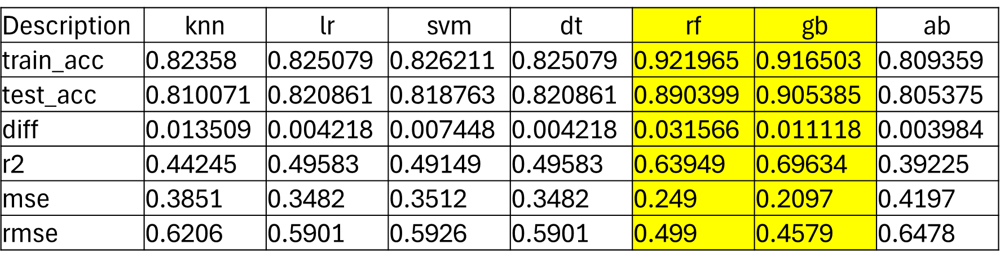
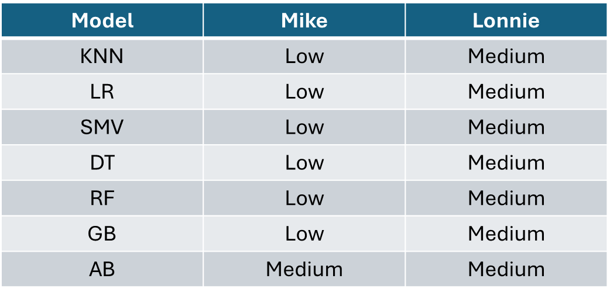

# Project 2 - Online Gaming Behavior

# Purpose/Description
This project is to explore online gaming engagement patterns and identify who is most susceptible to different levels of engagement based on their gaming profiles. Using a variety of machine learning classification models, we predict how likely players are to exhibit high, medium, or low engagement with online games.

# Goals
The goal of this project was to identify, train and test several classification models and determine which one(s) were the best.  Optimization was done on the top two models to try and improve their accuracy.

A secondary goal of the project was to build online gaming profiles for class members who were willing to share their information and then do a prediction on their profiles.

# Overview of Data Collection and Analysis
The data set that was used was found on kaggle.  [link](https://www.kaggle.com/datasets/rabieelkharoua/predict-online-gaming-behavior-dataset/code)  
The data set is free to use as per licence found [here](https://creativecommons.org/licenses/by/4.0/)

The data was in very good shape with no missing values and did not require any additional cleaning.  It did require OneHotEncoding to prepare the object features and scaling to prepare numeric features for use in the models.

Seven different classification models were used: KNN, Logistic Regression, SVM, Decision Tree, Random Forest, Gradient Boosting, and Adaboost.

Elbow diagrams were developed on KNN, Random Forest, and Gradient Boosting to better optimize each of them.  

# Results
The final presentation of results can be found in the Power Point file [here](https://github.com/LaserLon/Project2/blob/main/Project2/Project-2-Presentation.pptx).  
The two best-performing models identified through analysis were Random Forest and Gradient Boosting. They showed the highest accuracy and stability in both training and test sets. Detailed performance metrics, including accuracy, R-squared, MSE, and RMSE, are summarized in the final results.

The following table summarizes the training and test accuracy scores as well as the difference between them, the R2, mean square, and root mean square values.

The second goal of the project was to evaluate users profiles by doing a prediction.  Profiles for Mike & Lonnie were developed and ran through each model.

The following table summarizes the predictions for both Mike & Lonnie.  

With the exception of Adaboost, all the models made the same prediction for each person.  Both Mike & Lonnie felt that the predictions made were accurate.

# File Struction/Links

The files for this project are organized as follows:  The files in folders Mike & Lonnie are individual working files used for the analysis. Once the analysis was completed, the code was organized and put into the final project results file, [model_analysis_final.ipynb](https://github.com/LaserLon/Project2/blob/main/Project2/model_analysis_final.ipynb).

Lonnie  
&nbsp;&nbsp;&nbsp;&nbsp;[model_analysis.ipynb](https://github.com/LaserLon/Project2/blob/main/Lonnie/model_analysis.ipynb)  
Mike  
&nbsp;&nbsp;&nbsp;&nbsp;[starter.ipynb](https://github.com/LaserLon/Project2/blob/main/Mike/starter.ipynb)  
&nbsp;&nbsp;&nbsp;&nbsp;[starter_organize.ipynb](https://github.com/LaserLon/Project2/blob/main/Mike/starter_organize.ipynb)  
Project2  
&nbsp;&nbsp;&nbsp;&nbsp;[model_analysis_final.ipynb](https://github.com/LaserLon/Project2/blob/main/Project2/model_analysis_final.ipynb)  
&nbsp;&nbsp;&nbsp;&nbsp;[model_analysis.ipynb](https://github.com/LaserLon/Project2/blob/main/Project2/model_analysis.ipynb)  
&nbsp;&nbsp;&nbsp;&nbsp;[Project-2-Presentation.pptx](https://github.com/LaserLon/Project2/blob/main/Project2/Project-2-Presentation.pptx)  
&nbsp;&nbsp;&nbsp;&nbsp;data:  
&nbsp;&nbsp;&nbsp;&nbsp;&nbsp;&nbsp;&nbsp;&nbsp;  [online_gaming_behavior_dataset.csv](https://github.com/LaserLon/Project2/blob/main/Project2/data/online_gaming_behavior_dataset.csv)
# Contributors
Mike Saunders  
Lonnie Aldredge
